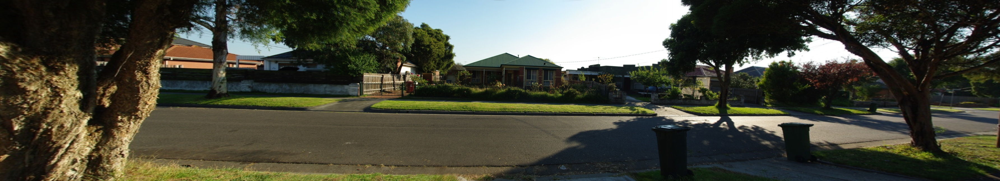
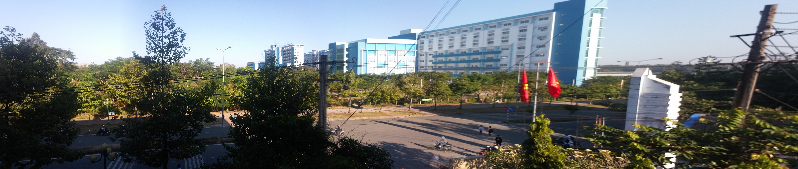
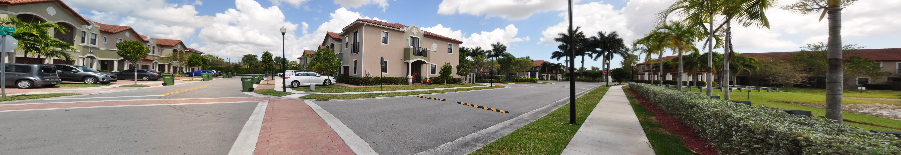

# Panorama
<li>This repository contains an implementation of multiple image stitching.
<li>Slow processing with high resolution images.
<li>Images must be supplied in left-to-right order or vice versa.
<li>Demo ->>> https://panorama4fun.herokuapp.com/


### Requirement
<li>python > 3.7
<li>opencv-contrib-python 4.7.0.72

### Usage
<li>pip install -r requirements.txt

```
python main.py -i INPUT [-o OUTPUT] [-r RESIZE] [-h]

options:
  -h, --help            show this help message and exit
  
  -i INPUT, --input INPUT
                        path to input directory
  -o OUTPUT, --output OUTPUT
                        path to output directory
  -r RESIZE (0|1), --resize RESIZE
                        enter 1 to resize lower resolution
```
	

### Project Structure :

		|_ main.py
		|_Step_By_Step.ipynb
		|_ utils.py
		|_ features.py
		|_ stitch.py
		|
		|_ data - |
		|			|_ myhouse
		|			|			|- 001.jpg
		|			|			|- 002.jpg
		|			|_ BK
		|			|			|- H1.jpg
		|			|			|- H2.jpg
		|			|			|- H3.jpg
		|			|.....etc.....
		|_result -|
		|          		|- myhouse.jpg
		|          		|- BK.jpg
		|		   	|.....etc.....

### To run :
#### IMPORTANT!!! Images must be supplied in left-to-right order or vice versa .

<li>Slow processing with high resolution images, so it must be resized before stitching
<li>if you want to resize input images :

    `python main.py -i <input dir> -o <output dir> -r 1 `

<li>Otherwise

    `python main.py -i <input dir> -o <output dir> `


## Outputs !!

<center>
<caption>Stitching using Myhouse example</caption><br><br>
<br>
<br><br>
<caption>Stitching using BK example</caption><br><br>
<br>
<br><br>
<caption>Stitching using city example</caption><br><br>
<br>
<br><br>
<caption>Stitching using parking lot example</caption><br>
<br>
<br><br>
<caption>Stitching using building example</caption><br>
<br>
<br><br>
</center>


### References :
[1] https://www.mathworks.com/help/vision/examples/feature-based-panoramic-image-stitching.html

[2] https://www.pyimagesearch.com/2016/01/11/opencv-panorama-stitching/

[3] http://ppwwyyxx.com/2016/How-to-Write-a-Panorama-Stitcher/
